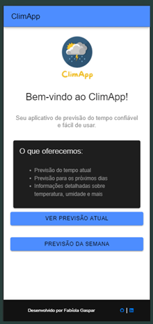

## ClimApp

ClimApp é uma aplicação moderna e intuitiva para previsão do tempo, desenvolvida como parte de um trabalho de avaliação do curso de Análise e Desenvolvimento de Sistemas no módulo de desenvolvimento mobile.

## Visão Geral

O aplicativo oferece uma experiência de usuário rica e interativa, permitindo aos usuários obter informações climáticas de forma rápida e eficiente. Ele é composto por três telas principais:

1. Tela de apresentação
2. Tela de previsão atual
3. Tela de previsão da semana


## Funcionalidades

- Consulta de previsão do tempo atual para uma cidade específica
- Visualização da previsão do tempo para a semana
- Lista de cidades pré-definidas para rápido acesso
- Opção de busca personalizada para qualquer cidade

## Tecnologias Utilizadas

- Ionic 7.2.0
- Angular
- TypeScript
- API OpenWeatherMap

## Instalação

Para instalar e executar este projeto localmente, siga estes passos:

1. Clone o repositório:
   ```
   git clone [URL_DO_SEU_REPOSITORIO]
   ```

2. Navegue até o diretório do projeto:
   ```
   cd ClimApp
   ```

3. Instale as dependências:
   ```
   npm install
   ```

4. Execute o aplicativo:
   ```
   ionic serve
   ```

## Estrutura do Projeto

- `src/app/home`: Página inicial com introdução ao aplicativo e botões de navegação
- `src/app/previsao-atual`: Página que exibe a previsão do tempo atual
- `src/app/previsao-semana`: Página que exibe a previsão do tempo para a semana
- `src/services/weather.service.ts`: Serviço que gerencia as chamadas à API do OpenWeatherMap

## Capturas de Tela

Aqui estão algumas capturas de tela do aplicativo em funcionamento:

| Tela Inicial | Previsão Atual | Previsão da Semana |
|:------------:|:--------------:|:------------------:|
|  |  |  |

## Contribuição

Este projeto foi desenvolvido como parte de um trabalho acadêmico. Contribuições, sugestões e feedbacks são bem-vindos.

## Autor
[[Fabíola Gaspar](https://www.linkedin.com/in/fabiola-melo-6a285a1bb/)]

Show Image


## Licença

Este projeto está sob a licença MIT. Veja o arquivo LICENSE para mais detalhes.
